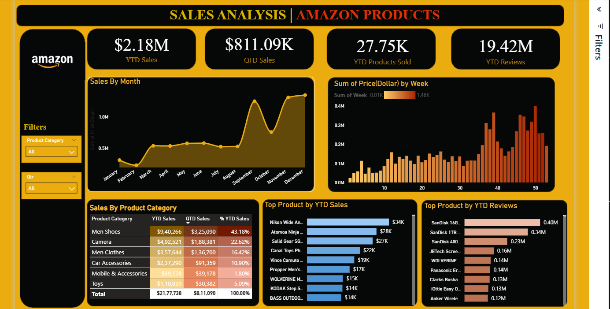

# Amazon Reviews Dashboard (Power BI)

A Power BI dashboard for exploring and analyzing Amazon product reviews. It provides quick insights into ratings, sentiment, review volume, trends over time, and product performance.

## Overview
- Analyze review counts, average ratings, and distribution of ratings.
- Track trends over time to identify seasonality and spikes.
- Explore sentiment and keywords to understand customer feedback themes.
- Filter by product, category, date range, and other dimensions.

## Repository Structure
- `amazon-reviews-dashboard/data/amazon-dashboard.pbix` — Main Power BI report file.
- `amazon-reviews-dashboard/data/raw/` — Expected folder for source data files (CSV/Parquet/etc.).
- `image.png` — Overview screenshot for quick preview.

## Prerequisites
- Windows with Microsoft Power BI Desktop installed (latest recommended).
- Source data files placed under `amazon-reviews-dashboard/data/raw/` (if refreshing data).

## Quick Start
1. Open `amazon-reviews-dashboard/data/amazon-dashboard.pbix` in Power BI Desktop.
2. Explore the report pages (Overview, Ratings, Trends, Products, Sentiment). Page names may vary depending on your version.
3. Use slicers and filters to focus on specific products, time periods, or categories.

## Data Refresh
If you have local data files and want to refresh:
- Place CSV/Parquet files in `amazon-reviews-dashboard/data/raw/`.
- In Power BI Desktop: Home → Transform data → Check the queries’ source paths.
- Update file paths or parameters if needed (e.g., set a `DataFolderPath` parameter to point at `amazon-reviews-dashboard/data/raw/`).
- Apply changes and then use Home → Refresh.

### Suggested File Naming (optional)
- Reviews: `reviews.csv` (columns like `review_id`, `product_id`, `review_text`, `rating`, `review_date`).
- Products: `products.csv` (columns like `product_id`, `product_name`, `category`, `brand`).
- Sentiment (if precomputed): `sentiment.csv` (columns like `review_id`, `sentiment_score`, `sentiment_label`).

Adjust to match your actual data schema; update Power Query steps to align.

## Customization
- Modify visualizations and measures to reflect your KPIs.
- Add or tweak relationships in Model view to connect tables correctly.
- Create new pages for deep dives (e.g., by category, brand, or time window).
- Use Power Query for data cleaning and enrichment (tokenization, keyword extraction, etc.).

## Troubleshooting
- Path issues: If refresh fails, confirm query sources point to `amazon-reviews-dashboard/data/raw/`.
- Relationships: If visuals look incorrect, review table relationships and cardinality in Model view.
- Performance: Disable auto date/time or optimize large queries; consider aggregations.
- Permissions: Ensure you have read access to the local data folder.

## Contributing
- Fork the repository and create feature branches for changes.
- Keep Power Query steps and measures organized with clear names.
- Provide sample data or document query parameters when adding new sources.
- Open a pull request with a summary, screenshots, and test notes.

## Notes
- This repository primarily houses a `.pbix` file and an expected raw data folder. The exact pages, visuals, and queries may differ based on your local setup and data.
- If you plan to share the report, consider parameterizing file paths and using relative paths where possible.

## Acknowledgments
- Built with Microsoft Power BI Desktop.
- Inspired by common e-commerce analytics metrics and review mining practices.